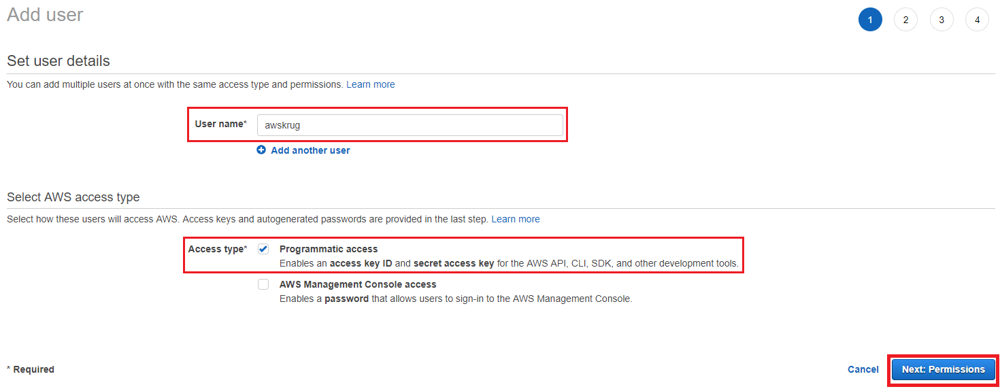
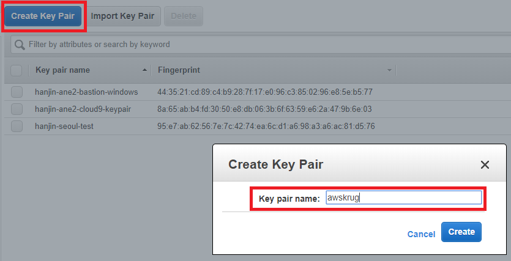
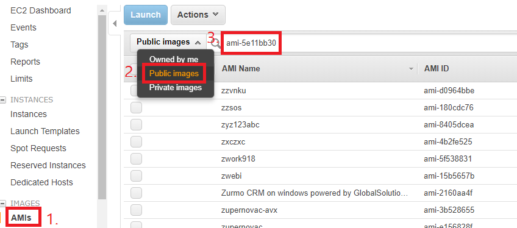
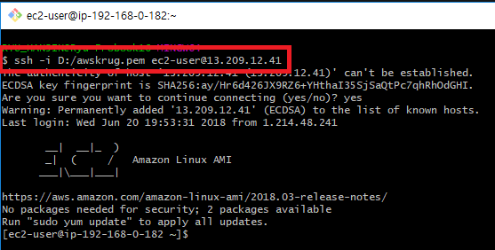

# Kubernetes Hands-on

## Index

<!-- TOC depthFrom:2 depthTo:6 withLinks:1 updateOnSave:1 orderedList:0 -->

* [Bastion](#bastion)
* [Cluster](#cluster)
* [Ingress](#ingress-controller)
* [Sample](#sample-application)
* [Dashboard](#dashboard)
* [Heapster](#heapster)
* [Autoscaler](#autoscaler)

<!-- /TOC -->

### Basic Knowledge

* Kubernetes 를 들어봤다.
* AWS 에 인스턴스 를 만들어 봤다.
* SSH 로 접속 을 할 수 있다.
* 필요 계정 : AWS
  * https://aws.amazon.com/ko/

## Bastion

### AWS IAM - Access keys

* AWS 객체들을 관리하기 위하여 Access Key 를 발급 받습니다.
* https://console.aws.amazon.com/iam/home?region=ap-northeast-2 를 브라우저에서 엽니다.
* 좌측 메뉴에서 `Users` 를 선택합니다.
* `Add user` 버튼으로 새 사용자를 만듭니다.

* User name 에 `awskrug` 를 입력합니다.
* `Programmatic access` 를 체크합니다.
* `Next: Permissions` 버튼을 눌러 다음 화면으로 이동합니다.

* `Attach existing policies directly` 를 선택합니다.
* `AdministratorAccess` 를 검색하여 선택합니다.
* `Next: Review` 버튼을 눌러 다음 화면으로 이동합니다.
* `Create user` 버튼을 눌러 새 유저를 만듭니다.
* 생성된 Access key ID와 Secret access key 는 실습에 사용하므로 메모장에 복사해둡니다.

Note:
- `발급 받은 키는 유출되지 않도록 잘 관리 해야 합니다.`
- `Administrator` 는 너무 많은 권한을 가지고 있고, 이를 가진 유저 생성은 추천하지 않습니다.
- IAM 의 권한은 다음만 주셔도 됩니다.
  - AmazonEC2FullAccess
  - AmazonRoute53FullAccess
  - AmazonS3FullAccess
  - IAMFullAccess
  - AmazonVPCFullAccess

### AWS EC2 - Key Pairs

* 생성할 Instance 에 접속하기 위하여 프라이빗 키를 발급 받습니다.
* https://ap-northeast-2.console.aws.amazon.com/ec2/v2/home 를 브라우저에서 엽니다.
* 좌측 메뉴에서 `Key Pairs` 를 선택합니다.

* `Create Key Pair` 버튼으로 새 키페어를 생성합니다.
* 이름은 `awskrug` 로 하겠습니다.
* 프라이빗 키 파일을 잘 저장해 둡니다.

Note:
- 파일명은 `awskrug.pem` 일 것 입니다.

### AWS EC2 - Instance

* 빠른 진행을 위하여 필요한 툴이 미리 설치된 AMI 로 부터 인스턴스를 생성 합니다.
* https://ap-northeast-2.console.aws.amazon.com/ec2/v2/home 를 브라우저에서 엽니다.

* 좌측 메뉴에서 `AMIs` 를 선택합니다.
* `Owned by me` 를 `Public images` 로 변경합니다.
* Add filter 에서 `AMI ID:` 를 선택 하고 `ami-0fade7d6d32c285f4` 를 입력합니다.
* 검색된 이미지로 `Launch` 를 선택 합니다.
* 기본 값인 `t2.micro` 를 사용 하겠습니다.
* `Next`와 `Review and Launch` 버튼을 눌러 다음 화면으로 이동합니다.
* `Launch` 버튼을 눌러 인스턴스를 생성합니다.
* Select a key pair 에 `awskrug` 가 선택 되었는지 확인합니다.
* 체크 박스를 체크 하고, `Launch Instances` 버튼으로 인스턴스를 생성합니다.

Note:
- 쉽게 찾는 링크
  - https://ap-northeast-2.console.aws.amazon.com/ec2/v2/home?region=ap-northeast-2#Images:visibility=public-images;imageId=ami-0fade7d6d32c285f4
- AMI 에 설치된 서비스
  - awscli, kops, kubectl, helm, docker
- CentOS 혹은 Amazon Linux 에서 다음 쉘로 설치 가능 합니다.
  - `curl -sL toast.sh/helper/bastion.sh | bash`

### AWS EC2 - 접속 (Windows 사용자 - Git Bash)

* https://ap-northeast-2.console.aws.amazon.com/ec2/v2/home 를 브라우저에서 엽니다.
* 좌측 메뉴에서 `Instances` 를 선택합니다.
* 방금 만들었던 인스턴스를 선택 합니다.
* `IPv4 Public IP` 에 생성된 `IP` 를 확인 합니다.

* https://git-scm.com/download/win 를 브라우저에서 엽니다.
  * 다운로드 되는 파일을 설치 합니다.



* `Git Bash` 로 인스턴스에 접속 할수 있습니다.
  * `PEM_PATH` 를 다운받은 `awskrug.pem` 파일 경로로 변경 합니다.
  * `PUBLIC_IP` 를 위에서 확인한 `IP` 로 변경하여 접속 합니다.

```bash
chmod 600 PEM_PATH/awskrug.pem
ssh -i PEM_PATH/awskrug.pem ec2-user@PUBLIC_IP
```

### AWS EC2 - 접속 (Windows 사용자 - PuTTY)

* https://ap-northeast-2.console.aws.amazon.com/ec2/v2/home 를 브라우저에서 엽니다.
* 좌측 메뉴에서 `Instances` 를 선택합니다.
* 방금 만들었던 인스턴스를 선택 합니다.
* `IPv4 Public IP` 에 생성된 `IP` 를 확인 합니다.

* https://the.earth.li/~sgtatham/putty/latest/w64/putty-64bit-0.70-installer.msi 를 다운로드 하여 설치 합니다.

* `PuTTYgen` 으로 프라이빗 키를 변환 해야 합니다.
  * `PuTTYgen` 을 시작합니다.
  * `Type of key to generate` 에서 `RSA` 를 선택합니다.
  * `Load` 를 선택합니다. `.pem` 파일을 찾으려면 모든 유형의 파일을 표시하는 옵션을 선택합니다.
  * `awskrug.pem` 을 선택합니다.
  * `Save private key` 버튼을 눌러 저장 합니다.
  * `awskrug.ppk` 가 만들어 졌습니다.

* `PuTTY` 로 인스턴스에 접속 할수 있습니다.
  * `PuTTY` 를 시작합니다.
  * `Category` 창에서 `Session` 을 선택하고 다음 필드를 작성합니다.
  * `Host Name` 에 `ec2-user@` 과 위에서 확인한 `IP` 를 입력 합니다.
  * `Category` 창에서 `Connection` `SSH` 를 확장하고, `Auth` 를 선택 합니다.
  * `Browse` 버튼을 눌러 `awskrug.ppk` 파일을 찾아 선택 합니다.
  * `Open` 버튼을 눌러 접속 합니다.

Note:
- https://docs.aws.amazon.com/ko_kr/AWSEC2/latest/UserGuide/putty.html

### AWS EC2 - 접속 (Mac 사용자)

* https://ap-northeast-2.console.aws.amazon.com/ec2/v2/home 를 브라우저에서 엽니다.
* 좌측 메뉴에서 `Instances` 를 선택합니다.
* 방금 만들었던 인스턴스를 선택 합니다.
* `IPv4 Public IP` 에 생성된 `IP` 를 확인 합니다.

* `Terminal` 로 인스턴스에 접속 할수 있습니다.
  * `PEM_PATH` 를 다운받은 `awskrug.pem` 파일 경로로 변경 합니다.
  * `PUBLIC_IP` 를 위에서 확인한 `IP` 로 변경하여 접속 합니다.

```bash
chmod 600 PEM_PATH/awskrug.pem
ssh -i PEM_PATH/awskrug.pem ec2-user@PUBLIC_IP
```

### SSH Key Gen


* 클러스터를 관리할 ssh-key 를 생성 합니다.

```bash
ssh-keygen -q -f ~/.ssh/id_rsa -N ''
```

Note:
- 클러스터 내에서 서로 접속 하기 위하여 필요 합니다.

### AWS Credentials


* IAM 으로 생성하여 메모장에 복사해둔 Access key ID 와 Secret access key 를 등록합니다.

```bash
aws configure
```

Note:
- AWS 에 객체를 생성하기 위하여 필요 합니다.

## Cluster


* 클러스터 이름을 설정 합니다.
* 클러스터 상태를 저장할 S3 Bucket 을 만들어 줍니다.
* `MY_UNIQUE_ID` 에는 본인의 이름을 넣어 만들어 주세요.

```bash
export KOPS_CLUSTER_NAME=awskrug.k8s.local
export KOPS_STATE_STORE=s3://kops-awskrug-MY_UNIQUE_ID

aws s3 mb ${KOPS_STATE_STORE} --region ap-northeast-2
```

### Create Cluster


* Cloud 는 AWS 를 사용 하겠습니다.
* Master Node 는 `c4.large` 1대로 하겠습니다.
* Worker Node 는 `t2.medium` 2대로 하겠습니다.

```bash
kops create cluster \
    --cloud=aws \
    --name=${KOPS_CLUSTER_NAME} \
    --state=${KOPS_STATE_STORE} \
    --master-size=c4.large \
    --node-size=t2.medium \
    --node-count=2 \
    --zones=ap-northeast-2a,ap-northeast-2c \
    --network-cidr=10.10.0.0/16 \
    --networking=calico
```
```
Must specify --yes to apply changes

Cluster configuration has been created.

Suggestions:
 * list clusters with: kops get cluster
 * edit this cluster with: kops edit cluster awskrug.k8s.local
 * edit your node instance group: kops edit ig --name=awskrug.k8s.local nodes
 * edit your master instance group: kops edit ig --name=awskrug.k8s.local master-ap-northeast-2a
```

Note:
- 위 명령을 실행해도 아직 클러스터는 만들어지지 않습니다.
- 저는 Jenkins X 시연을 위하여 m4.xlarge 를 선택 하였습니다.
- https://aws.amazon.com/ko/ec2/pricing/on-demand/

### Edit Cluster

* 클러스터를 생성하기 전, 클러스터를 수정 할수 있습니다.

```bash
kops get cluster

# edit cluster
kops edit cluster
```

* Cluster Autoscalier 에서 node 를 늘려 줄 수 있도록 `node maxSize` 를 변경 합니다.

```bash
kops edit ig nodes
```
```
spec:
  image: kope.io/k8s-1.9-debian-jessie-amd64-hvm-ebs-2018-03-11
  machineType: t2.medium
  maxSize: 10
  minSize: 2
```

### Create Cluster

* `kops update` 명령에 `--yes` 옵션으로 실제 클러스터가 생성 됩니다.

```bash
kops update cluster --name=${KOPS_CLUSTER_NAME} --yes
```
```
Cluster is starting.  It should be ready in a few minutes.

Suggestions:
 * validate cluster: kops validate cluster
 * list nodes: kubectl get nodes --show-labels
 * ssh to the master: ssh -i ~/.ssh/id_rsa admin@api.awskrug.k8s.local
```

Note:
- VPC, Instance, ELB, Auto Scaling Group 에 관련 객체들이 생성됩니다.
- 클러스터 생성 완료까지 `10분` 정도 소요 됩니다.

### Validate Cluster

* `kops validate` 명령으로 생성이 완료 되었는지 확인 할수 있습니다.

```bash
kops validate cluster --name=${KOPS_CLUSTER_NAME}
```
```
Validating cluster awskrug.k8s.local

INSTANCE GROUPS
NAME                   ROLE   MACHINETYPE MIN MAX SUBNETS
master-ap-northeast-2a Master c4.large    1   1   ap-northeast-2a
nodes                  Node   t2.medium   2   2   ap-northeast-2a,ap-northeast-2c

NODE STATUS
NAME                                           ROLE   READY
ip-10-10-10-10.ap-northeast-2.compute.internal master True
ip-10-10-10-11.ap-northeast-2.compute.internal node   True
ip-10-10-10-12.ap-northeast-2.compute.internal node   True

Your cluster awskrug.k8s.local is ready
```

### kubectl

* 생성이 완료 되었으면, 다음 명령으로 정보를 조회 할수 있습니다.

```bash
kubectl get node

kubectl get deploy,pod,svc --all-namespaces

kubectl get deploy,pod,svc -n kube-system
kubectl get deploy,pod,svc -n default
```

Note:
- 모든 네임스페이스 혹은 지정한 네임스페이스 객체를 조회 할수 있습니다.
- https://kubernetes.io/docs/tasks/

## Addons

### Ingress Controller

* Ingress Controller 로 도메인을 내부 서비스로 연결해 줍니다.

```bash
wget https://raw.githubusercontent.com/nalbam/kubernetes/master/addons/ingress-nginx-v1.6.0.yml

kubectl apply -f ingress-nginx-v1.6.0.yml
```
```
namespace/kube-ingress created
serviceaccount/nginx-ingress-controller created
clusterrole.rbac.authorization.k8s.io/nginx-ingress-controller created
role.rbac.authorization.k8s.io/nginx-ingress-controller created
clusterrolebinding.rbac.authorization.k8s.io/nginx-ingress-controller created
rolebinding.rbac.authorization.k8s.io/nginx-ingress-controller created
service/nginx-default-backend created
deployment.extensions/nginx-default-backend created
configmap/ingress-nginx created
service/ingress-nginx created
deployment.extensions/ingress-nginx created
```

* Ingress-nginx 의 ELB 에서 얻은 IP 로 nip.io 도메인을 만듭니다.

```bash
# ELB 도메인을 획득 합니다.
kubectl get svc -o wide -n kube-ingress

# ELB 도메인으로 ip 를 획득 합니다.
dig +short $(kubectl get svc -o wide -n kube-ingress | grep ingress-nginx | awk '{print $4}' | head -n 1)
```

### Sample Application

* 샘플 어플리케이션 yaml 파일을 다운 받아 vi 로 편집 합니다.
* 파일 하단의 nalbam.com 부분을 위의 ELB IP 를 넣어 `0.0.0.0.nip.io` 로 바꿔줍니다. 

```bash
wget https://raw.githubusercontent.com/nalbam/kubernetes/master/sample/sample-spring-ing.yml

vi sample-spring-ing.yml
```
```yaml
spec:
  rules:
  - host: sample-spring.apps.0.0.0.0.nip.io
    http:
      paths:
      - path: /
        backend:
          serviceName: sample-spring
          servicePort: 80
```

* 샘플 어플리케이션을 생성해 봅니다.

```bash
kubectl apply -f sample-spring-ing.yml
```
```
deployment.apps/sample-spring created
service/sample-spring created
ingress.extensions/sample-spring created
horizontalpodautoscaler.autoscaling/sample-spring created
```

* Pod 와 Service 가 만들어졌습니다.

```bash
kubectl get deploy,pod,svc -n default
```

* Ingress 설정에 의하여 각 도메인이 Ingress Controller 와 연결 되었습니다.

```bash
kubectl get ing -o wide -n default
```
```
NAME            HOSTS                               ADDRESS                                                 PORTS     AGE
sample-spring   sample-spring.apps.0.0.0.0.nip.io   a2aed74f77e8b-129875.ap-northeast-2.elb.amazonaws.com   80        43m
```

### Dashboard

* 웹 UI 를 통하여 정보와 상태를 볼수 있도록 Dashboard 를 올려 보겠습니다.

```bash
wget https://raw.githubusercontent.com/nalbam/kubernetes/master/addons/dashboard-v1.8.3.yml

kubectl apply -f dashboard-v1.8.3-ing.yml
```
```
secret "kubernetes-dashboard-certs" created
serviceaccount "kubernetes-dashboard" created
role.rbac.authorization.k8s.io "kubernetes-dashboard-minimal" created
rolebinding.rbac.authorization.k8s.io "kubernetes-dashboard-minimal" created
deployment.apps "kubernetes-dashboard" created
service "kubernetes-dashboard" created
```

* dashboard 에 접속 하기 위해 `ServiceAccount` 와 `Role` 이 필요 합니다.
* `kube-system` 네임스페이스에 `admin` 유저를 만들겠습니다.

```bash
kubectl create serviceaccount admin -n kube-system
```
```
serviceaccount "admin" created
```

* `admin` 유저에 `cluster-admin` 권한을 부여 하겠습니다.

```bash
kubectl create clusterrolebinding cluster-admin:kube-system:admin --clusterrole=cluster-admin --serviceaccount=kube-system:admin
```
```
clusterrolebinding.rbac.authorization.k8s.io "cluster-admin:kube-system:admin" created
```

* 로그인은 `Token` 을 사용 하겠습니다.
* `Secret` 에서 `admin-token` 을 조회 해서 붙여 넣습니다.

```bash
kubectl describe secret $(kubectl get secret -n kube-system | grep admin-token | awk '{print $1}') -n kube-system
```

Note:
- https://github.com/kubernetes/dashboard/

### Heapster

* 대시보드 로는 충분한 정보를 볼수 잆습니다. 예를 들면 CPU, Memory...
* 힙스터를 설치하고 잠시 기다리면 정보가 수집되고, 대시보드에 보여집니다.

```bash
wget https://raw.githubusercontent.com/nalbam/kubernetes/master/addons/heapster-v1.7.0.yml

kubectl apply -f heapster-v1.7.0.yml
```
```
deployment.extensions "heapster" created
service "heapster" created
serviceaccount "heapster" created
clusterrolebinding.rbac.authorization.k8s.io "heapster" created
role.rbac.authorization.k8s.io "system:pod-nanny" created
rolebinding.rbac.authorization.k8s.io "heapster-binding" created
```

* 잠시 후 Heapster 가 정보를 수집하면 Dashboard 에 관련 정보를 추가로 볼 수 있습니다.
* 또한, CLI 로도 조회가 가능 합니다.

```bash
kubectl top pod --all-namespaces

kubectl top pod -n kube-system
kubectl top pod -n default
```

Note:
- 힙스터는 현재 `DEPRECATED` 되었습니다.
- 모니터링을 위해 `metrics-server` 또는 `Prometheus` 를 고려해 보시기 바랍니다.
- https://github.com/kubernetes/heapster/

### Pod Autoscaler

* 사용량이 늘어남에 따라 pod 를 늘어나고, 사용량이 줄어듦에 따라 pod 가 줄어드는 매직을 부려 봅니다.
* 이미 `sample-spring` 에는 `HorizontalPodAutoscaler` 가 선언 되어있습니다.
* CPU 사용량을 얻기 위하여 `metrics-server` 를 설치 합니다.

```bash
git clone https://github.com/kubernetes-incubator/metrics-server

kubectl apply -f metrics-server/deploy/1.8+/
```

* `Deployment` 의 `replicas: 2` 인데, pod 를 조회 해보면. `1`로 줄어들어 있습니다.
* `HorizontalPodAutoscaler` 설정에 따라 사용량이 없어서 `1`로 줄였기 때문 입니다.

```bash
kubectl get hpa
```
```
NAME            REFERENCE                  TARGETS         MINPODS   MAXPODS   REPLICAS   AGE
sample-spring   Deployment/sample-spring   1%/50%          1         100       1          3m
```

* 아파치 (httpd) 를 설치하면 ab (apache benchmark) 가 설치 됩니다.

* 동시 1개 (concurrency, -c) 에서 백만개의 요청을 (requests, -n) 보내 봅시다.
* 이 명령은 새창으로 해봅시다.

```bash
ab -n 1000000 -c 1 http://sample-spring.apps.0.0.0.0.nip.io/stress
```

* pod 가 늘어나면서, `TARGETS` 을 `50%` 이하로 맞추려고 노력 할 것 입니다.

```bash
kubectl get hpa -w
```
```
NAME            REFERENCE                  TARGETS    MINPODS   MAXPODS   REPLICAS
sample-spring   Deployment/sample-spring   1%/50%     1         100       1
sample-spring   Deployment/sample-spring   195%/50%   1         100       1
sample-spring   Deployment/sample-spring   241%/50%   1         100       4
sample-spring   Deployment/sample-spring   98%/50%    1         100       4
sample-spring   Deployment/sample-spring   80%/50%    1         100       4
sample-spring   Deployment/sample-spring   86%/50%    1         100       4
sample-spring   Deployment/sample-spring   63%/50%    1         100       7
sample-spring   Deployment/sample-spring   49%/50%    1         100       7
sample-spring   Deployment/sample-spring   37%/50%    1         100       7
```

Note:
- 7개 정도는 무리 없이 감당하는군요.

### Cluster Autoscaler

* 이번에는 동시 5개 (concurrency, -c) 에서 백만개의 요청을 (requests, -n) 보내 봅시다.
* 이 명령은 새창으로 해봅시다.

```bash
ab -n 1000000 -c 5 http://sample-spring.apps.0.0.0.0.nip.io/stress
```

```bash
kubectl get hpa -w
```
```
NAME            REFERENCE                  TARGETS    MINPODS   MAXPODS   REPLICAS
sample-spring   Deployment/sample-spring   77%/50%    1         100       14
sample-spring   Deployment/sample-spring   61%/50%    1         100       14
```

* 사용량이 더 늘어나면, 현재의 Cluster 공간보다 더 많은 Application 을 띄우려 시도 할것 입니다.
* 하지만 공간이 부족하여 더이상 pod 가 생성되지 않고 에러가 나고있습니다.

* 그래서 `Cluster Autoscaler` 설치해 봅니다.

```bash
wget https://raw.githubusercontent.com/nalbam/kubernetes/master/addons/cluster-autoscaler-v1.8.0.yml

kubectl apply -f cluster-autoscaler-v1.8.0.yml
```
```
serviceaccount/cluster-autoscaler created
clusterrole.rbac.authorization.k8s.io/cluster-autoscaler created
role.rbac.authorization.k8s.io/cluster-autoscaler created
clusterrolebinding.rbac.authorization.k8s.io/cluster-autoscaler created
rolebinding.rbac.authorization.k8s.io/cluster-autoscaler created
deployment.extensions/cluster-autoscaler created
```

* node 가 `1`개 늘어 `3`개가 되었습니다.

```bash
kubectl get node
```
```
NAME                                              STATUS    ROLES     AGE       VERSION
ip-10-10-10-10.ap-northeast-2.compute.internal    Ready     master    41m       v1.9.6
ip-10-10-10-11.ap-northeast-2.compute.internal    Ready     node      39m       v1.9.6
ip-10-10-10-12.ap-northeast-2.compute.internal    Ready     node      39m       v1.9.6
ip-10-10-10-13.ap-northeast-2.compute.internal    Ready     node      12m       v1.9.6
```

* pod 도 이제 `19` 에서 안정화 되었습니다.

```bash
kubectl get hpa -w
```
```
NAME            REFERENCE                  TARGETS    MINPODS   MAXPODS   REPLICAS
sample-spring   Deployment/sample-spring   148%/50%   1         100       8
sample-spring   Deployment/sample-spring   152%/50%   1         100       8
sample-spring   Deployment/sample-spring   114%/50%   1         100       16
sample-spring   Deployment/sample-spring   80%/50%    1         100       16
sample-spring   Deployment/sample-spring   57%/50%    1         100       16
sample-spring   Deployment/sample-spring   53%/50%    1         100       16
sample-spring   Deployment/sample-spring   59%/50%    1         100       19
sample-spring   Deployment/sample-spring   53%/50%    1         100       19
sample-spring   Deployment/sample-spring   53%/50%    1         100       19
sample-spring   Deployment/sample-spring   44%/50%    1         100       19
sample-spring   Deployment/sample-spring   44%/50%    1         100       19
```

## Clean Up

* Kubernetes Cluster 를 지웁니다.

```bash
kops delete cluster --name=${KOPS_CLUSTER_NAME} --yes
```

* EC2 Instance (bastion) 를 지웁니다.
  * https://ap-northeast-2.console.aws.amazon.com/ec2/v2/home?region=ap-northeast-2#Instances

* EC2 Key Pair 를 지웁니다.
  * https://ap-northeast-2.console.aws.amazon.com/ec2/v2/home?region=ap-northeast-2#KeyPairs

* IAM User 를 지웁니다.
  * https://console.aws.amazon.com/iam/home?region=ap-northeast-2#/users

## Thank You
